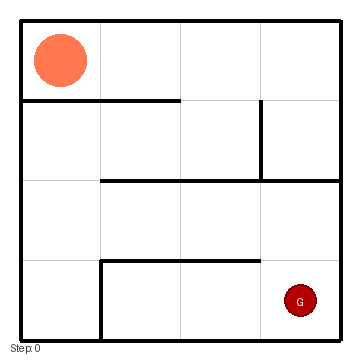

# AI Maze Solver — A Game, an Experiment, and a Tiny AI

Imagine a small grid world: you're dropped into a maze, you can move up, down, left or right, and your goal is to reach the far corner. Simple, right? But what if you wanted to build an algorithm that plays this game perfectly every time — no trial-and-error, no hallucinations, just provably optimal moves?

This repository is my hands-on experiment: I designed a 4x4 maze, implemented A* search in Java, and documented my thought process like a developer who also loves to explain what they tried and why. I did this because I was curious whether I could build my own tiny AI to solve a toy game without leaning on large language models for the logic.

Why this project (the story)

- I got tired of asking LLMs for solutions and wanted to prove I could write an algorithmic agent from first principles.
- It's framed as a little game: map the maze, pick a heuristic, and see whether your solver can find the shortest path.
- This repo shows thinking, trade-offs, and practical engineering — the kinds of things recruiters and interviewers look for.

What you'll find here

- `MazeRunner.java` — the A* implementation (driver + inner Node class). This is the "AI" that plays the maze.
- `Maze.java` — a compact 4x4 maze representation with explicit connectivity (walls) encoded as boolean arrays.
- `State.java` — a tiny container for cell coordinates.
- (Deleted) `Node.java` — I removed a redundant top-level Node to keep implementation details encapsulated.

Key technical highlights (what I built and why)

- A* search for shortest path: deterministic, optimal when using an admissible heuristic.
- Heuristic: Manhattan distance (|dr| + |dc|). I chose it because it's admissible and consistent for a 4-direction grid and keeps the implementation simple and provably correct.
- Implementation details I care about: keeping Node private to the search, using a `bestG` map to avoid stale/expanded duplicates, and reconstructing the path via parent pointers.

Why this matters to a recruiter

- Demonstrates algorithmic understanding: A* is a classic algorithm and knowing its admissibility/consistency properties shows strong fundamentals.
- Shows engineering judgment: encapsulation, clear APIs (`Maze.start()`, `Maze.goal()`, `neighbors()`), and pragmatic choices for readability and correctness.
- Communicates thinking: the code contains student-style comments that explain "I did this because..." at important decision points.

How to run it

Make sure you have a JDK installed (I used a local JDK in the repo for convenience but a system JDK works). From the project root:

```bash
javac *.java
java MazeRunner
```

You should see a path printed (e.g. `00 -> 10 -> 11 -> 12 -> 13 -> 23` and the step count). If the maze is unsolvable the program prints a friendly message.

What I learned

- Heuristics matter: an admissible, consistent heuristic (like Manhattan for grid moves) guarantees optimal results without complicated bookkeeping.
- Encapsulation helps: I removed a duplicate `Node.java` to avoid confusion — the search Node is an implementation detail that belongs inside `MazeRunner`.
- Small experiments are powerful: a tiny, well-documented implementation communicates a lot about judgment and clarity.

Possible next steps (how I'd expand this project)

- Make the maze format loadable from a text or JSON file so I can try larger mazes or random generators.
- Add BFS/DFS/Dijkstra variants and compare performance and memory usage across algorithms.
- Implement A* with a non-admissible heuristic (for experimentation) and show how it can find suboptimal paths faster.
- Visualize the maze and the search process (simple Swing UI or export steps to CSV for visualization elsewhere).
- Add unit tests and small benchmarks to demonstrate correctness and performance.

If you're a recruiter or a fellow engineer: thanks for reading. If you'd like me to walk through the code or pair-program improvements (visualization, larger mazes, or stochastic generators), I'm happy to add that and explain design choices in a short video or live demo.

Demo

Below is a short animated demo of the solver running on the 4x4 maze (start marked in green, goal in red):



The GIF was generated by running `java MazeRunner` to get the path and then a small Python script (`make_gif.py`) which draws the maze and animates the agent following the solution.

License

This is my personal project. Feel free to reuse code for learning or interview prep; give credit if you publish it publicly.

---

